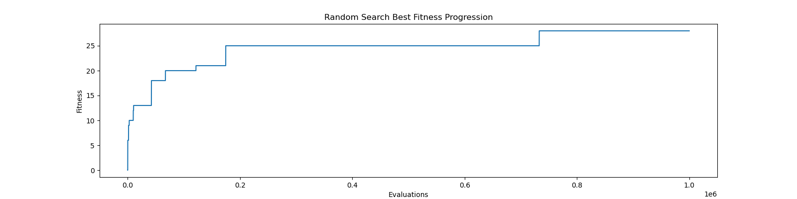
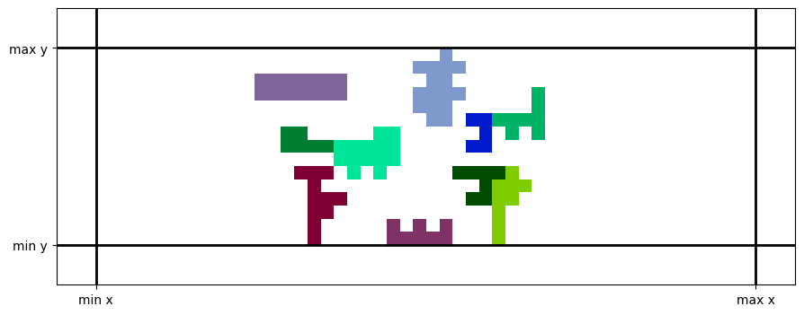

# COMP 5660 Fall 2023 Assignment 1a
Matthew Freestone  
maf0083@auburn.edu  
September 2, 2023  

## Stairstep Plot

This plot came from trial 13, which yielded a best fitness of 28.  

The solution yielded by this trial is shown below.  


## Statistical Analysis  
The mean and standard deviation of each dataset and the t-test values are as follows:  
```
my data mean: 24.966666666666665
my data stdv: 1.7515182248421006
mystery data mean: 32.36666666666667
mystery data stdv: 0.6686751354593717
p-value: 1.092620614308096e-22
```
Given that the p-value is incredibly small, we can firmly reject the null hypothesis that the two datasets are the same. The mean of the mystery data set is significantly higher, so we can also claim that the mystery data yields better results.
